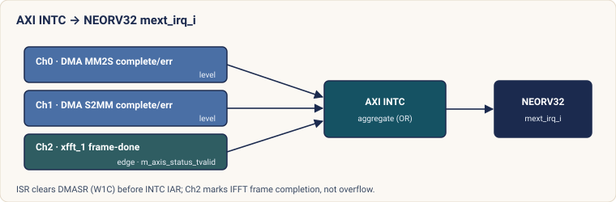

# Developer Reference

Detailed reference for contributors and integrators.  For setup and first
run, see [GETTING_STARTED.md](GETTING_STARTED.md).

---

## Repository layout

Fabric hierarchy (**`xem7310_top.vhd`** vs **`ostomachion_bd_wrapper`**) matches the ASCII stack in the root [README.md](README.md) (Architecture / RTL design).

```
.
├── Makefile                          # Build orchestration (GHDL sim, Zephyr, FPGA)
├── west.yml                          # West manifest — pins Zephyr SHA + SDK version
├── .github/workflows/ci.yml          # GitHub Actions CI (sim, twister, vhdl-lint, …)
├── .github/workflows/vivado-synth.yml  # Manual Vivado synthesis (self-hosted runner)
├── docs/
│   ├── img/logo.svg                  # Project logo
│   ├── diagrams/                     # Hand-authored architecture SVGs (README / ACCEL_ARCH / …)
│   ├── acceptance_test_procedure.md  # HIL / self-hosted runner expectations
│   └── neorv32_upgrade_notes.md    # Checklist before bumping the neorv32 submodule
├── scripts/
│   ├── init_dev_env.sh               # Source to set ZEPHYR_BASE, venv, FRONTPANEL_DIR, Vivado PATH
│   ├── uart_bridge.py                # FrontPanel UART-over-USB bridge (PTY ↔ Pipes)
│   ├── uart_upload.py                # NEORV32 bootloader upload (used by make fpga-fw, test-*-hw)
│   ├── fpga_program.py               # FrontPanel USB bitstream load (used by make fpga-program)
│   ├── bin2vhd.py                    # ELF binary → VHDL IMEM image
│   └── gen_release_artifacts.sh      # Stage release/<VERSION>/ certification artifacts
├── rtl/
│   └── neorv32_wrapper.vhd           # Simulation wrapper around neorv32_top
├── fpga/xem7310/
│   ├── xem7310_top.vhd               # Board top: IBUFDS, NEORV32, bridge, BD wrapper, FrontPanel, filter, bypass mux
│   ├── spectral_filter.vhd           # Per-bin complex filter Y[k]=H[k]·X[k] (between xfft_0 and xfft_1)
│   ├── cmpy_normalizer.vhd           # Q2.30 → Q1.15 round/saturate for the filter multiply
│   ├── fft_beat_counter.vhd          # Passive xfft beat/TLAST counter (WireOut 0x22 / 0x27)
│   ├── fp_uart_bridge.vhd            # FrontPanel UART bridge (async FIFOs + Pipe endpoints)
│   ├── fp_fft_pipe_bridge.vhd        # FrontPanel FFT sample pipes + filter cfg / status (WireIn 0x01, WireOut 0x28)
│   ├── xem7310.xdc                   # Vivado pin + timing constraints (XC7A200T)
│   ├── build.tcl                     # Non-interactive Vivado batch script
│   ├── ostomachion_bd.tcl            # IP Integrator block design (AXI DMA, xfft ×2, TX/RX/coeff BRAM, INTC, GPIO)
│   ├── check_build.tcl               # Post-build quality gates (timing, utilisation, DRC)
│   ├── program_jtag.tcl              # JTAG bitstream programming (fallback)
│   ├── program_flash.tcl             # SPI flash programming (persistent boot)
│   └── openocd.cfg                   # NEORV32 OCD debug (external JTAG adapter)
├── sim/
│   ├── neorv32_tb.vhd                # GHDL testbench (clock, reset, SPI/I2C/UART monitors)
│   └── sim_uart_rx.vhd               # UART character decoder
├── neorv32/                          # NEORV32 RTL submodule (v1.11.6)
│   └── rtl/system_integration/xbus2axi4_bridge.vhd   # XBUS → AXI4-Lite (FPGA fabric; vhdl-lint CI)
├── sw/test_gpio_uart/                # Bare-metal smoke-test firmware (C)
├── host_tests/                       # Host (non-Zephyr) unit tests
│   ├── CMakeLists.txt                # ctest project (run via remote-build.sh math)
│   └── test_filter_mask.cpp          # filter_mask.hpp synthesis vs golden model
├── tools/fft_demo/                   # PyQt6 desktop demo (drives the fabric filter live)
│   ├── app.py                        # GUI: sliders, filter panel, 3-pane plots
│   ├── transport.py                  # FrontPanel ok.FrontPanel wrapper (pipes + filter cfg/status)
│   ├── sources.py                    # Q1.15 signal generators + pipe pack/unpack
│   ├── filter_mask.py                # Host mask synth (mirrors filter_mask.hpp) + cfg/status words
│   ├── smoke_test.py / test_*.py     # CLI smoke test + mask / mock-UI / HIL tests
│   └── README.md                     # Demo usage
└── zephyr_app/
    ├── CMakeLists.txt
    ├── testcase.yaml                 # West Twister test matrix (app root → buildable project)
    ├── zephyr/module.yml             # Registers this tree as a Zephyr module (drivers/bindings)
    ├── prj.conf                      # Base Kconfig — SPI, I2C, GPIO, C++20 (clean production base; ZTEST opt-in)
    ├── prj_fpga.conf                 # Overlay — FPGA (IRQ drivers, larger stacks)
    ├── prj_accel.conf                # Overlay — FFT accelerator
    ├── prj_shell.conf                # Overlay — interactive shell (no ZTEST)
    ├── prj_demo.conf                 # Overlay — host-pipe FFT demo (CONFIG_FFT_DEMO)
    ├── prj_hw_test.conf              # Overlay — verbose hardware test
    ├── app.overlay                   # DTS — spi0, i2c0 (simulation + FPGA base)
    ├── app_fpga.overlay              # DTS overlay — 115200 baud, FPGA clocks
    ├── app_accel.overlay             # DTS overlay — fft_accel node + IRQ
    ├── include/
    │   ├── ostomachion/
    │   │   ├── accel.hpp             # Generic Accel / AccelOpDesc base (RTTI-free)
    │   │   ├── filter_mask.hpp       # Brick-wall mask synthesis (host- + target-compilable)
    │   │   └── hal/
    │   │       ├── gpio.hpp          # GpioOutput + GpioInput
    │   │       ├── spi.hpp           # SpiDevice (std::span API)
    │   │       ├── i2c.hpp           # I2cBus (std::span API)
    │   │       └── fft_accel.hpp     # FftAccel (: Accel, C++20 RAII wrapper)
    │   └── zephyr/drivers/misc/
    │       └── fft_accel.h           # Public C API: fft_accel_transform(), _get_last_overflow()
    ├── src/
    │   ├── main.cpp                  # LED heartbeat thread (K_THREAD_DEFINE)
    │   ├── fft_shell.c               # "fft" shell commands (incl. "fft filter")
    │   ├── fft_demo_main.c           # Host-pipe FFT/filter demo thread (CONFIG_FFT_DEMO)
    │   └── test_runner.c             # "test run" shell command
    ├── tests/                       # ZTEST suites (compiled in when CONFIG_ZTEST=y)
    │   ├── test_spi.cpp
    │   ├── test_i2c.cpp
    │   ├── test_gpio.cpp
    │   ├── test_fft_accel.cpp       # Forward FFT + filter HIL tests
    │   ├── test_filter_mask.cpp     # On-sim mask-synthesis ZTEST
    │   └── test_wdt.cpp
    ├── dts/bindings/
    │   ├── misc/ostomachion,fft-accel.yaml
    │   ├── spi/neorv32,spi.yaml
    │   ├── i2c/neorv32,twi.yaml
    │   └── wdt/neorv32,wdt.yaml
    └── drivers/
        ├── spi/spi_neorv32.c
        ├── i2c/i2c_neorv32.c
        ├── accel/fft_accel.c         # FFT accelerator driver (DMA, semaphore, ISR)
        └── wdt/wdt_neorv32.c
```

---

## Peripheral map

| Peripheral | Sim | XEM7310 | MMIO base | IRQ | Zephyr driver |
|-----------|-----|---------|-----------|-----|---------------|
| GPIO (8 pins) | ✅ | ✅ | `0xFFFFFFC0` | — | `neorv32,gpio` |
| UART0 | ✅ | ✅ | `0xFFFFFFE0` | FIRQ 2 | `neorv32,uart` |
| SPI master | ✅ | ✅ | `0xFFF80000` | FIRQ 6 | `neorv32,spi` |
| I2C master | ✅ | ✅ | `0xFFF90000` | FIRQ 7 | `neorv32,twi` |
| CLINT | ✅ | ✅ | `0xF0000000` | — | `neorv32,clint` |
| Watchdog | — | ✅ | — | — | `neorv32,wdt` |
| AXI DMA ctrl | — | ✅ | `0x40000000` | MEI (IRQ 11) | `ostomachion,fft-accel` |
| TX BRAM | — | ✅ | `0x41000000` (32 KB) | — | (part of fft-accel) |
| RX BRAM | — | ✅ | `0x41008000` (32 KB) | — | (part of fft-accel) |
| coeff BRAM | — | ✅ | `0x42000000` (16 KB) | — | (part of fft-accel; filter `H[k]`) |
| AXI INTC | — | ✅ | `0x40010000` | — | (part of fft-accel) |
| AXI GPIO | — | ✅ | `0x40020000` | — | (BD only; ch1 reset+bypass, ch2 overflow) |

IMEM: 128 KB (FPGA), 64 KB (sim).  DMEM: 64 KB both targets.

**GHDL / sim:** Xilinx **xfft** and the block design are not simulated; the default `prj.conf` image runs **SPI, I2C, and GPIO** ZTEST suites only. **WDT** and **FFT** tests are compiled for Twister or FPGA overlays (`prj_fpga.conf`, `prj_accel.conf`, `CONFIG_WDT_NEORV32`, `CONFIG_FFT_ACCEL` — see `CMakeLists.txt`).

**Interrupt topology**: AXI INTC (PG099) aggregates three sources into the
single NEORV32 MEI line: Ch0 = DMA MM2S, Ch1 = DMA S2MM, Ch2 = xfft
frame-complete (`m_axis_status_tvalid`, sourced from the inverse `xfft_1` on
the filter bitstream).  The driver ISR reads INTC ISR to identify pending
sources and acknowledges via INTC IAR after clearing DMA DMASR (W1C) to avoid
spurious re-entry on the level-sensitive channels.  Full contract in
[ACCEL_ARCH.md](ACCEL_ARCH.md).

---

## HAL API

All HAL classes live in `namespace ostomachion` and are header-only
zero-overhead wrappers around the Zephyr C APIs.

### `GpioOutput` / `GpioInput`

```cpp
ostomachion::hal::GpioOutput led{GPIO_DT_SPEC_GET(DT_ALIAS(led0), gpios)};
led.set(true);
led.toggle();

ostomachion::hal::GpioInput btn{GPIO_DT_SPEC_GET(DT_ALIAS(sw0), gpios)};
bool active = btn.is_active();  // respects DTS active-state polarity
```

### `SpiDevice`

```cpp
static const spi_config cfg = {
    .frequency = 1'000'000,
    .operation = SPI_OP_MODE_MASTER | SPI_WORD_SET(8) | SPI_TRANSFER_MSB,
};
ostomachion::hal::SpiDevice spi{DEVICE_DT_GET(DT_NODELABEL(spi0)), cfg};

std::array<std::byte, 4> tx{std::byte{0x11}, std::byte{0x22},
                             std::byte{0x33}, std::byte{0x44}};
std::array<std::byte, 4> rx{};
int err = spi.transfer(std::span{tx}, std::span{rx});
```

### `I2cBus`

```cpp
ostomachion::hal::I2cBus i2c{DEVICE_DT_GET(DT_NODELABEL(i2c0))};
std::array<std::byte, 1> tx{std::byte{0x42}};
std::array<std::byte, 1> rx{};
int err = i2c.write_then_read(0x50U, tx, rx);  // REPEATED START
```

### `FftAccel`

```cpp
#include <ostomachion/hal/fft_accel.hpp>

const struct device *dev = DEVICE_DT_GET(DT_NODELABEL(fft_accel));
ostomachion::FftAccel accel{dev};

static fft_sample_t in[4096]{};   // Q1.15 complex: {int16_t re, int16_t im}
static fft_sample_t out[4096]{};

in[0].re = 16384;  // 0.5 in Q1.15
int err = accel.transform(in, out, 4096);          // forward FFT → bins

if (accel.last_overflow()) { /* reduce input amplitude */ }
```

The same device also drives the programmable filter (FFT → per-bin
`H[k]·X[k]` → IFFT → time).  Load a mask, then run the filtered round trip:

```cpp
static ostomachion::filter::Coeff scratch[4096];   // synth target
accel.set_lowpass(4096, /*cutoff bin*/ 256, /*gain*/ 0x7FFF, scratch);
int err = accel.transform_filtered(in, out, 4096);  // out is time-domain
```

`load_coeffs()` writes a raw 4096-entry table; `set_lowpass/highpass/bandpass/
notch()` synthesise a brick-wall mask (via `ostomachion::filter`) and load it.
The synthesis math is host-testable and bit-identical to the fabric — see
[ACCEL_ARCH.md §7](ACCEL_ARCH.md#7-programmable-frequency-domain-filter-fft--filter--ifft).

Via the generic platform interface:

```cpp
ostomachion::FftOpDesc    op{in, out, 4096};        // forward FFT
ostomachion::FilterOpDesc fop{in, out, 4096};       // filtered round trip
int err = accel.submit(op);  // type-safe, no RTTI
```

`transform()` / `submit()` return codes:

| Code | Meaning |
|------|---------|
| `0` | Success |
| `-ENODEV` | Device not ready |
| `-EINVAL` | `n != 4096` |
| `-ETIMEDOUT` | DMA did not complete within `CONFIG_FFT_ACCEL_TIMEOUT_MS` |
| `-EIO` | DMA bus fault |

Kconfig: `CONFIG_FFT_ACCEL=y`, `CONFIG_FFT_ACCEL_TIMEOUT_MS` (default 100 ms).

---

## Accelerator abstraction

`include/ostomachion/accel.hpp` defines the generic platform interface:

```cpp
namespace ostomachion {

struct AccelOpDesc {
    enum class Type : unsigned { Unknown = 0, Fft = 1, Filter = 2 };
    const Type type_id;
protected:
    explicit AccelOpDesc(Type t = Type::Unknown) : type_id{t} {}
};

class Accel {
public:
    [[nodiscard]] virtual bool ready()                        const noexcept = 0;
    [[nodiscard]] virtual int  submit(const AccelOpDesc &op)       noexcept = 0;
    [[nodiscard]] virtual bool last_overflow()                const noexcept { return false; }
};
```

`AccelOpDesc::type_id` enables safe `static_cast` dispatch in concrete
`submit()` implementations — no `dynamic_cast` needed under `-fno-rtti`.

**Adding a new accelerator:**
1. Add `MatMul = 2` to `AccelOpDesc::Type`.
2. Create `MatMulOpDesc : AccelOpDesc` with operation parameters.
3. Create `MatMulAccel : Accel` implementing `submit()`.
4. Write the C driver and DTS binding following the `fft_accel` pattern.

---

## Memory model

There is no heap.  `CONFIG_HEAP_MEM_POOL_SIZE = 0`.

| What | Mechanism |
|------|-----------|
| FFT sample buffers | `static fft_sample_t g_fft_in[4096]` (BSS) |
| Driver state | Zephyr `DEVICE_DEFINE` macro (linker section) |
| Thread stacks | `CONFIG_MAIN_STACK_SIZE` etc. (link time) |
| Semaphores, mutexes | `K_SEM_DEFINE`, `K_MUTEX_DEFINE` (static) |

Verify at link time: `riscv64-zephyr-elf-nm --size-sort zephyr.elf`.

---

## C++20 in embedded

The build uses `-nostdinc++` (Zephyr's minimal C++ layer, no libstdc++).

| Feature | Available |
|---------|-----------|
| `constexpr`, `[[nodiscard]]`, concepts | ✅ (compiler intrinsic) |
| `std::span`, `std::array` | ✅ (Zephyr provides) |
| `virtual`, vtables | ✅ (RTTI not needed for vtables) |
| `std::string`, `std::vector` | ❌ (heap-dependent) |
| `dynamic_cast`, `typeid` | ❌ (`-fno-rtti`) |
| Exceptions | ❌ (`-fno-exceptions`) |

Use `static_cast` with `AccelOpDesc::type_id` instead of `dynamic_cast`.
Use errno return codes instead of exceptions.

---

## Continuous integration

`.github/workflows/ci.yml` — five jobs on PR and push to `main`/`master`/`develop`:

| Job | Runner | What it does |
|-----|--------|-------------|
| `host-tests` | ubuntu-latest | CMake + ctest on `host_tests/` (filter-mask synthesis math; no GHDL/Vivado) |
| `sim` | ubuntu-latest | `make ZEPHYR_SIM_TIME=1200ms test-zephyr`; assert `PROJECT EXECUTION SUCCESSFUL` in the log |
| `twister` | ubuntu-latest | `west twister -T zephyr_app --integration --exclude-tag hw` (after `sim` succeeds) |
| `vhdl-lint` | ubuntu-latest | GHDL `-i`: NEORV32 core lib, `xbus2axi4_bridge.vhd`, `rtl/neorv32_wrapper.vhd` |
| `firmware-analysis` | ubuntu-latest | clang-tidy, `nm --size-sort` memory map, thread analyser (runs after `twister`) |

`.github/workflows/vivado-synth.yml` — **manual only** (`workflow_dispatch`):

| Job | Runner | What it does |
|-----|--------|-------------|
| `vivado-synth` | self-hosted, label `vivado` | `make fpga-synth && make fpga-check`, upload `.bit` + reports — trigger from Actions tab |

In-progress runs are cancelled when a new commit arrives on the same ref (`concurrency`).

**Local vs CI Zephyr board:** the Makefile defaults to `ZEPHYR_BOARD = neorv32/neorv32/minimalboot` for `make zephyr` / `make test-zephyr`. The CI `sim` job uses `-b neorv32` with `-DCONF_FILE=prj.conf`; both paths use the same application `prj.conf` baseline.

---

## Testing

### GHDL simulation

```bash
make test-zephyr      # Zephyr + GHDL: SPI / I2C / GPIO ZTEST (default prj.conf)
make test-baremetal   # bare-metal GPIO + UART smoke test
```

The testbench (`sim/neorv32_tb.vhd`) models:
- **SPI**: MOSI wired to MISO; every byte is echoed back unchanged.
- **I2C**: Synthesised slave at `0x50`; ACKs all writes, returns `0x5A` on reads.
- **Hang detector**: at **390 ms** simulated time, the bench fails if the GPIO heartbeat has not advanced (firmware stuck); this is **not** the NEORV32 watchdog peripheral (WDT tests require `CONFIG_WDT_NEORV32` and FPGA DTS — see Twister / `make test-hw`).

ZTEST output format (parsed by CI and Twister):

```
Running TESTSUITE ostomachion_spi
 PASS - test_loopback_zero
 PASS - test_full_duplex
TESTSUITE ostomachion_spi succeeded
...
PROJECT EXECUTION SUCCESSFUL
```

### West Twister

```bash
west twister -T zephyr_app --integration --exclude-tag hw -v
```

> `testcase.yaml` lives at the `zephyr_app/` root (next to `CMakeLists.txt` /
> `prj.conf`) so Twister has a buildable project; the ZTEST suites under
> `zephyr_app/tests/` are compiled into the build by `CMakeLists.txt` when
> `CONFIG_ZTEST=y`.

| Test ID | Board | Type |
|---------|-------|------|
| `ostomachion.peripherals.baseline` | neorv32 sim | build + run |
| `ostomachion.filter.mask` | neorv32 sim | build + run (mask-synthesis ZTEST) |
| `ostomachion.fft.compile` | neorv32 sim | build only |
| `ostomachion.shell.compile` | neorv32 sim | build only |
| `ostomachion.wdt.compile` | neorv32 sim | build + run |
| `ostomachion.hw.peripherals` | xem7310 | HIL (`xem7310_hw` fixture) |
| `ostomachion.hw.fft` | xem7310 | HIL (`xem7310_hw_fft` fixture) |

HIL tests require a self-hosted runner (label `xem7310`), the XEM7310
connected, a programmed bitstream, and the harness fixtures named above.
See [docs/acceptance_test_procedure.md](docs/acceptance_test_procedure.md)
for runner setup and acceptance flow.

---

## Extending the platform

### Adding a new NEORV32 peripheral

1. Enable the `IO_*_EN` generic in `rtl/neorv32_wrapper.vhd`; wire I/O ports.
2. Create `dts/bindings/<bus>/neorv32,<periph>.yaml`.
3. Write `drivers/<bus>/<periph>_neorv32.c` following `spi_neorv32.c`.
4. Add `include/ostomachion/hal/<periph>.hpp` in `namespace ostomachion::hal`.
5. Write `tests/test_<periph>.cpp` and add a Twister entry to `testcase.yaml`.

### Adding a new hardware accelerator

1. Add the IP to `ostomachion_bd.tcl`; wire AXI4-Lite, AXI4-Stream, and IRQ.
2. Wire the IRQ to the next free `irq_concat_intc` channel; update `C_NUM_INTR_INPUTS`.
3. Create a DTS binding and overlay following `ostomachion,fft-accel.yaml`.
4. Write the C driver following `fft_accel.c` (`k_sem_reset` before each transfer, `device_is_ready` guard).
5. Add `Type::<NewAccel>` to `AccelOpDesc::Type`; create `NewAccelOpDesc` and `NewAccel : Accel`.

---

## Full Makefile target reference

| Target | Description |
|--------|-------------|
| `make test-default` | Clean + simulate with built-in NEORV32 demo |
| `make test-baremetal` | Build bare-metal firmware + simulate |
| `make test-zephyr` | Build Zephyr (sim config) + simulate |
| `make zephyr` | Build Zephyr (simulation target) only |
| `make zephyr-fpga` | Build Zephyr for FPGA (115200 baud, IRQ drivers) |
| `make sw` | Build bare-metal firmware only |
| `make clean-ghdl` | Remove GHDL artifacts |
| `make clean` | Full clean (GHDL + firmware + all Zephyr build dirs) |
| `make fpga-synth` | Vivado: synthesise + implement + bitstream + MCS |
| `make fpga-program` | Load bitstream (volatile, FrontPanel USB) |
| `make fpga-flash` | Program SPI flash (persistent) |
| `make uart-bridge` | Start FrontPanel UART bridge (PTY) |
| `make fpga-fw` | Upload firmware via UART bootloader |
| `make fpga-check` | Post-build quality gates (timing, utilisation, DRC) |
| `make fpga-release VERSION=v1.0.0` | Stage certification artifacts |
| `make test-hw` | Upload + run SPI/I2C/GPIO/WDT ZTEST firmware |
| `make test-accel-hw` | Upload + run FFT accelerator ZTEST firmware |
| `make shell-hw` | Upload interactive shell firmware |

**Debug ILA bitstream** (logic analyser probes on AXI-Stream and IRQ nets):

```bash
vivado -mode batch -source fpga/xem7310/build.tcl -tclargs debug \
    | tee build/xem7310/build_debug.log
# outputs: ostomachion_xem7310_debug.bit + debug_probes.ltx
```

Load the `.bit` via JTAG and open `.ltx` in Vivado Hardware Manager.

---

## Boot and firmware loading

The SoC boots through the **upstream NEORV32 BROM bootloader**, selected by the
`BOOT_MODE_SELECT` generic on `neorv32_top`. Ostomachion uses two modes — one per
target — so the same firmware ELF reaches the core by a different path in
simulation and on hardware.

| | Simulation (`neorv32_wrapper.vhd`) | FPGA (`xem7310_top.vhd`) |
|---|---|---|
| `BOOT_MODE_SELECT` | **2** — IMEM-as-ROM | **0** — internal BROM bootloader |
| Firmware enters core via | IMEM pre-initialised at elaboration | UART upload (or SPI-flash auto-boot) |
| First-contact UART baud | n/a (no negotiation) | **19200**, fixed in the BROM |
| Why | skips the multi-second UART negotiation on every GHDL run | re-flash firmware without re-synthesising the bitstream |

### Image artifacts

Zephyr's post-build step runs the NEORV32 `image_gen` tool (located via
`-DCMAKE_PROGRAM_PATH=$(IMAGE_GEN_DIR)`, [`neorv32/sw/image_gen/`](neorv32/sw/image_gen/))
to emit three forms of the same firmware — pick the one the boot path needs:

| Artifact | Format | Consumed by |
|----------|--------|-------------|
| `zephyr.bin` | raw binary, no header | input to `image_gen` (not booted directly) |
| `zephyr_exe.bin` | **12-byte NEORV32 header** + binary | UART/SPI bootloader upload (hardware) |
| `zephyr.vhd` | VHDL package initialising IMEM | GHDL simulation (IMEM-as-ROM) |

The executable header is a 12-byte preamble — signature `0x4788CAFE`, byte
count, and a two's-complement checksum — that the bootloader validates before
copying the image to IMEM `0x0000_0000` and jumping to it. A signature or
checksum mismatch is rejected (no partial image runs).

### Simulation boot path

`make zephyr` builds the app and copies `zephyr.vhd` to `zephyr_imem_image.vhd`;
`make test-zephyr` analyses that package so IMEM is **pre-loaded at elaboration**.
With `BOOT_MODE_SELECT=2` the core executes from `0x0000_0000` immediately — no
bootloader, no UART handshake. (See [Testing → GHDL simulation](#ghdl-simulation).)

### Hardware boot path

On power-up (`BOOT_MODE_SELECT=0`) the BROM prints a banner and starts a ~10 s
auto-boot countdown at 19200 baud:

1. **Any received byte aborts** the countdown and drops to the interactive
   bootloader console (`u` upload, `s` store-to-SPI-flash, `l` load-from-flash,
   `e` execute).
2. **On timeout** the BROM attempts to load a valid executable from SPI flash
   (`0x0040_0000`); if found it copies it to IMEM and runs it, otherwise it
   falls through to the console and waits.

`make fpga-fw` (and `test-hw` / `test-accel-hw` / `shell-hw` / `demo-hw`) drive
this with [`scripts/uart_upload.py`](scripts/uart_upload.py): send a space to
abort the countdown, `u`, wait for `Awaiting neorv32_exe.bin`, stream
`zephyr_exe.bin` in 256-byte chunks, then `e` to execute. All of it runs at the
fixed 19200 baud.

### The UART bridge and the 19200 → 115200 switch

Without an external USB-UART adapter, the bootloader UART is tunnelled over
FrontPanel by [`fp_uart_bridge.vhd`](fpga/xem7310/fp_uart_bridge.vhd) (BTPipe
`0x80`/`0xA0`), and `make uart-bridge` exposes it as a host PTY. The bridge's
baud divisor is driven from **WireIn `0x00`** (`baud_div = round(100 MHz /
baud) − 1`: `0x1457` = 19200, `0x0363` = 115200), defaulting to 19200 for
bootloader contact. After `uart_upload.py` finishes, the make targets signal the
bridge with **`SIGUSR1`** to switch the divisor to 115200 — because the
application console runs at 115200 while the BROM is locked to 19200. Connect a
terminal (`minicom -b 115200`) to the PTY to see the application after upload.

### Persistent boot (SPI flash) — two independent images

The XEM7310 SPI flash holds **two unrelated images** at different offsets; do not
conflate them:

- **`make fpga-flash`** writes the **FPGA bitstream** (`*.bit`) to flash via the
  FrontPanel `FlashLoader`, so the FPGA self-configures the SoC on every
  power-up. It does **not** write firmware.
- The bootloader's **`s` console command** writes the **firmware executable**
  (`zephyr_exe.bin`, header included) to flash at `0x0040_0000`, so the BROM's
  auto-boot loads it after the 10 s timeout. There is **no execute-in-place**:
  the bootloader always copies the image into IMEM before running it.

A fully persistent board therefore needs **both** — `fpga-flash` for the
gateware and a one-time bootloader `s` for the firmware.

---

## Design decisions

**Two targets, one codebase.**  Target-specific differences are isolated to a
VHDL top-level, a DTS overlay, and a Kconfig fragment.  No application code
knows which environment it runs in.

**Interrupt-driven on hardware, polling available for simulation.**
`CONFIG_SPI_NEORV32_INTERRUPT=y` and `CONFIG_I2C_NEORV32_INTERRUPT=y`
(enabled by `prj_fpga.conf`) use FIRQ 6/7 to yield the thread between bytes.
The polling fallback avoids FIRQ timing dependencies in the GHDL testbench.
Both paths compile from the same source, gated by `#ifdef`.

**`BOOT_MODE_SELECT = 2` for simulation, `0` for FPGA.**  Mode 2 skips the
UART bootloader (a multi-second negotiation on every GHDL run); mode 0 on
hardware lets `make fpga-fw` upload new firmware without re-synthesising.  Full
boot flow in [Boot and firmware loading](#boot-and-firmware-loading).

**115200 baud everywhere except the bootloader.**  The NEORV32 BROM always
runs at 19200 baud — fixed, cannot change without recompiling the bootloader.
Application firmware switches to 115200 immediately on boot (the UART bridge
follows via the `SIGUSR1` divisor switch).

**No heap.**  `CONFIG_HEAP_MEM_POOL_SIZE = 0`.  See [Memory model](#memory-model).

**XBUS bus-access timeout.**  NEORV32's `XBUS_TIMEOUT` (default 255 cycles)
auto-terminates accesses that receive no ACK, raising a bus fault exception.
The `xbus2axi4_bridge` relies on this rather than a bridge-side watchdog.

**IOBUF and IBUFDS in the FPGA top.**  `xem7310_top.vhd` instantiates Xilinx
`IBUFDS` and `IOBUF` directly; `neorv32_wrapper.vhd` remains technology-neutral
for simulation.

---

## Interrupt architecture



- Channels 0 and 1 are **level-sensitive** (`C_KIND_OF_INTR` bits 0–1 = 0):
  `mm2s_introut`/`s2mm_introut` stay asserted until DMASR is W1C-cleared.
- Channel 2 is **edge-sensitive** (`C_KIND_OF_INTR` bit 2 = 1):
  `m_axis_status_tvalid` is a single-cycle pulse from the inverse `xfft_1`
  (frame complete = whole filtered result ready).  It marks frame completion,
  not overflow specifically — see [ACCEL_ARCH.md §2.2](ACCEL_ARCH.md#22-axi-intc-channel-wiring).

The ISR clears DMASR (W1C) before writing INTC IAR; acknowledging IAR before
the source de-asserts causes the ISR bit to re-assert immediately (spurious
re-entry) on level-sensitive channels.

To add further accelerators: wire their IRQs to new INTC channels, widen
`irq_concat_intc` and `C_NUM_INTR_INPUTS` in `ostomachion_bd.tcl`, and add
channel handling to the driver ISR.

---

## Debugging with waveforms

```bash
make test-zephyr WAVE=1
gtkwave output.ghw
```

| Signal path | What it shows |
|-------------|---------------|
| `neorv32_tb.dut.neorv32_inst.clk_i` | System clock |
| `neorv32_tb.dut.neorv32_inst.rstn_i` | Active-low reset |
| `neorv32_tb.gpio` | GPIO output (8 bits) |
| `neorv32_tb.uart_tx` | UART TX serial line |
| `neorv32_tb.spi_mosi` | SPI MOSI |
| `neorv32_tb.twi_sda` | I2C SDA (open-drain) |

UART text is also decoded to `UART0.log`:

```bash
cat UART0.log
```

---

## NEORV32 version lock

This project uses **NEORV32 v1.11.6**, pinned by submodule hash.  Before
upgrading, read [`docs/neorv32_upgrade_notes.md`](docs/neorv32_upgrade_notes.md).

Key concerns:
- Verify `uart_neorv32.c` register bit positions against new `neorv32_uart.h`.
- Check for `neorv32_top` generic renames (run `vhdl-lint` CI first).
- Allow for a full re-synthesis and re-acceptance test (~2 engineer-days).

**Do not upgrade for the v1.0.0 client delivery.**  Plan as a separate work
item post-acceptance.
