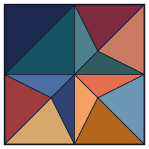
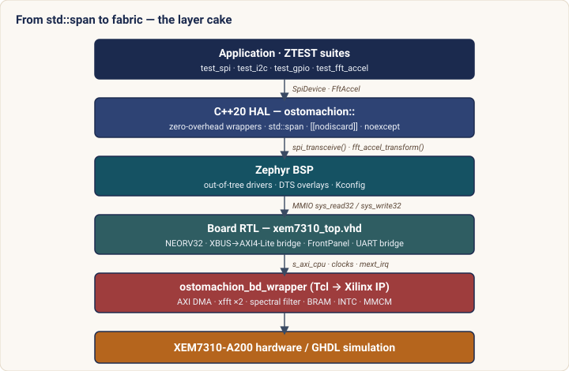
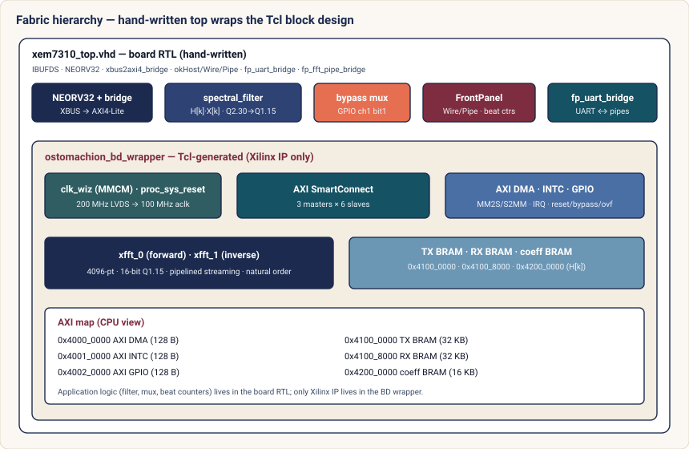
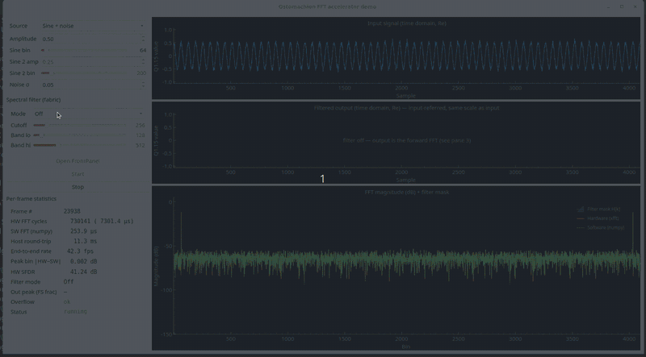

<p align="center">
  <a href="https://github.com/andynicholson/Ostomachion/actions/workflows/ci.yml?query=branch%3Amaster+event%3Apush">
    
  </a>
  <a href="LICENSE">
    
  </a>
  <a href="LICENSES/Ostomachion-Commercial-1.0.txt">
    
  </a>
</p>

Ostomachion is Archimedes' dissection puzzle — fourteen geometric pieces that
fit together in hundreds of distinct ways.  The name captures the design
philosophy: a small set of composable, interlocking parts that assemble into a complete, verified FPGA RTOS platform.

<p align="center">
  
</p>

## What is Ostomachion?

[NEORV32 RISC-V](https://github.com/stnolting/neorv32) SoC running [Zephyr RTOS](https://www.zephyrproject.org/) on FPGA bare metal - with an extensible accelerator pipeline architecture, including a DMA-enabled programmable spectral filter pipeline - wrapped in C++20 HAL from fabric to std::span.

The entire FPGA build is programmatic — a single Tcl script regenerates the full Vivado block design (IP configuration, clock tree, AXI address map, interconnect, and optional ILA debug probes) under headless `vivado -mode batch`, so every bitstream is reproducible from version-controlled text alone with no hand-edited checkpoints or saved GUI state anywhere in the tree.

Target hardware: **Opal Kelly XEM7310-A200** (Xilinx Artix-7 XC7A200T).
Simulation: **GHDL** with a full peripheral testbench.

## The fourteen pieces

Archimedes’ puzzle has fourteen tiles; here they are the composable layers of the platform, bottom to top:

1. **Artix-7 FPGA hardware** — XEM7310-A200, pin and timing constraints (`fpga/xem7310/xem7310.xdc`), volatile/persistent programming via FrontPanel USB.
2. **[NEORV32 RISC-V](https://github.com/stnolting/neorv32) SoC RTL** — Upstream `neorv32/` submodule (v1.11.6): RISC-V core, on-chip memory, CLINT, GPIO, UART, SPI, I2C (TWI), and external-bus masters.
3. **Board top-level VHDL** — `fpga/xem7310/xem7310_top.vhd` stitches clocks, resets, SoC, bridge, block-design wrapper, FrontPanel, pads, and the UART pipe bridge.
4. **XBUS → AXI4-Lite bridge** — RTL path from the CPU’s external bus to the Xilinx fabric for memory-mapped control of IP.
5. **Tcl-only Vivado block design** — `fpga/xem7310/ostomachion_bd.tcl` recreates the IP Integrator canvas from script (no hand-edited block design in the GUI necessary); sourced by the batch flow in `build.tcl`.
6. **Clocking and resets in fabric** — On-board LVDS oscillator → IBUFDS → MMCM in the BD (100 MHz system clock, locked status, peripheral reset network).
7. **Programmable frequency-domain transform pipeline** — time → forward **xfft** (4096-point, 16-bit, streaming) → **per-bin complex filter** (a user-programmable mask `H[k]` in a coefficient BRAM, applied by a fabric complex multiply) → inverse **xfft** → time, with **AXI DMA** staging through TX/RX **BRAM**.  A bypass bit lets the same bitstream serve both the plain forward FFT and the filtered round trip, so user-space can synthesise low/high/band-pass, notch, or arbitrary masks and run them in hardware.  **AXI INTC** aggregates the two DMA completion lines and the frame-complete pulse onto NEORV32 `mext_irq`.  Full design contract in [ACCEL_ARCH.md](ACCEL_ARCH.md).
8. **FrontPanel host interface** — `okHost` / pipes / wires in RTL for bitstream load, debug, and high-speed host I/O alongside MC headers.
9. **FrontPanel UART bridge** — `fp_uart_bridge.vhd` connects NEORV32 UART to FrontPanel pipes for host serial without extra USB-UART wiring.
10. **[Zephyr RTOS](https://www.zephyrproject.org/) and board port** — `west.yml` + board/soc glue; Zephyr is the primary RTOS for applications and drivers.
11. **Out-of-tree Zephyr drivers (C)** — `zephyr_app/drivers/` for NEORV32 SPI, TWI, watchdog, and the MMIO/IRQ-heavy `fft_accel` driver (DMA completion, INTC demux, timeouts).
12. **Devicetree and Kconfig** — Bindings under `zephyr_app/dts/`, base and target overlays (`app*.overlay`), and `prj*.conf` splits for simulation, FPGA, accelerator, shell, and hardware-test builds.
13. **C++20 header-only HAL** — `zephyr_app/include/ostomachion/` wraps Zephyr’s C APIs with `std::span`, `[[nodiscard]]`, and RAII-style device handles for GPIO, SPI, I2C, and FFT.
14. **Verification and automation** — GHDL testbench (`sim/`, `rtl/neorv32_wrapper.vhd`) for RTL-level peripherals; **ZTEST** suites and Twister matrix under `zephyr_app/tests/`; `Makefile` and CI for sim, firmware, and Vivado synthesis quality gates (`check_build.tcl`).

## Architecture

Every layer is a thin, replaceable wrapper over the one below it — from a
`std::span` in a test, down to a beat on an AXI-Stream bus.



### RTL design (`xem7310_top` + `ostomachion_bd`)

Fabric RTL is split between **hand-written board VHDL** and a **Tcl-built Vivado block design**. `fpga/xem7310/xem7310_top.vhd` is the top: it brings in the 200 MHz LVDS clock (`IBUFDS`), pads and primitives for SPI, UART, TWI (`IOBUF`), JTAG and LEDs, **FrontPanel** (`okHost`, wires, pipes), **`fp_uart_bridge`** and **`fp_fft_pipe_bridge`** (NEORV32 UART / FFT samples ↔ host pipes), the **`spectral_filter`** and bypass mux, **`neorv32_top`**, and **`xbus2axi4_bridge`**, which terminates in the AXI4-Lite master port **`s_axi_cpu`** on the block design. The SoC external interrupt **`mext_irq`** is driven from the BD. Vivado generates **`ostomachion_bd_wrapper`** from `fpga/xem7310/ostomachion_bd.tcl` (`make_wrapper`); that wrapper contains **only Xilinx IP** — application logic (the filter, the mux, the beat counters) lives in the board RTL, never inside the canvas.



## Live spectral-filter demo

The clearest way to *see* the platform working is the **PyQt6 desktop demo**
([`tools/fft_demo/`](tools/fft_demo/)): it streams frames to the real FPGA,
runs them through the genuine **FFT → per-bin filter → IFFT** fabric datapath,
and plots what comes back — in real time, over the FrontPanel USB link.

<!-- Replace with the recorded session (screen capture of `python -m fft_demo`
     driving the live filter).  Drop the file at docs/img/fft_demo.gif (or .mp4)
     and it renders here. -->
<p align="center">
  
</p>

> **Recording:** the clip above shows a host-generated signal being filtered
> *in fabric* — as the cutoff sliders move, the shaded pass-band on the
> spectrum tracks them and the filtered time-domain output changes live, with
> no re-synthesis and no host-side DSP.

### What the recording shows

Everything in the window is driven by the FPGA, not simulated on the host. The
demo firmware ([`fft_demo_main.c`](zephyr_app/src/fft_demo_main.c)) reads each
input frame from a FrontPanel pipe into TX BRAM, runs `fft_accel_transform()`
(bypass → frequency bins) or `fft_accel_transform_filtered()` (→ filtered
time-domain) through the accelerator driver, and streams the result back — the
same DMA/xfft/INTC contract used everywhere else, only with FrontPanel pipes
substituted for UART on the bulk-sample path.

**Left panel — you drive the inputs live:**

- **Signal source** — Sine, Two sines, Noise, Sine + noise, or DC, with
  amplitude, per-tone bin, and noise-σ controls. Each frame is generated on the
  host as 4096 Q1.15 complex samples and pushed to the fabric.
- **Spectral filter (fabric)** — pick **Low-pass**, **High-pass**,
  **Band-pass**, or **Notch** (or **Off** for the plain forward FFT) and drag
  the cutoff / band-edge sliders. The selection is packed into a control word
  and sent over `WireIn 0x01`; the firmware synthesises the brick-wall mask
  `H[k]`, loads it into the coefficient BRAM, and switches the datapath to the
  filtered round trip. Slider drags are debounced so a sweep doesn't reload the
  mask every pixel.

**Three stacked plots — what the fabric returns:**

1. **Input signal (time domain)** — the generated frame, on a fixed ±1 axis.
2. **Filtered output (time domain)** — the IFFT result coming back from the
   fabric. With the v1.0.0 **unity round trip** (unscaled inverse FFT, see
   [ACCEL_ARCH.md §7.1](ACCEL_ARCH.md)) this pane shares the input's fixed ±1
   axis, so a passed signal returns at ~input amplitude and a stopped one sits
   near zero **on the same scale** — pass vs stop bands are directly comparable
   by eye. (A `--attenuated-output` flag restores the old autoranged view for a
   legacy ÷N-scaled bitstream.)
3. **FFT magnitude (dB) + filter mask** — the hardware spectrum with the chosen
   filter's pass-band `H[k]` shaded on top, so you can watch the mask move with
   the sliders and see which bins survive. In bypass it also overlays the
   host `numpy.fft` reference (dashed) as a correctness check.

**Live stats (updated every frame)** report the hardware compute time
(`HW FFT cycles`), the host `numpy` time for comparison, the end-to-end frame
rate, the numerical agreement at the peak bin and HW SFDR (in bypass), the
filter mode the fabric is actually applying (read back from `WireOut 0x28`),
and an **OVERFLOW** flag if a transform saturated.

### Running it yourself

```bash
source scripts/init_dev_env.sh
make fpga-synth && make fpga-program        # one-time: build + load the bitstream
make demo-hw UART_DEVICE=/dev/pts/N         # build + upload the demo firmware (via the UART bridge)
pip install -r tools/fft_demo/requirements.txt
python3 -m fft_demo                          # launch the GUI, then click "Open FrontPanel" → "Start"
```

A headless smoke test (`python3 -m fft_demo.smoke_test`) and an on-hardware
control-channel test (`python3 -m fft_demo.hil_filter_test`) verify the same
path without a display. Full walkthrough and protocol details in
[`tools/fft_demo/README.md`](tools/fft_demo/README.md).

## Repository layout

```
Makefile                  Build orchestration (GHDL sim, Zephyr, FPGA)
fpga/xem7310/             RTL, constraints, Vivado scripts, block design
rtl/                      Simulation wrapper (neorv32_wrapper.vhd)
sim/                      GHDL testbench and UART monitor
neorv32/                  NEORV32 RTL submodule (v1.11.6)
scripts/                  init_dev_env.sh, uart_bridge.py, bin2vhd.py
sw/test_gpio_uart/        Bare-metal smoke-test firmware
zephyr_app/               Zephyr application, drivers, HAL, tests
docs/                     Design documents and acceptance procedure
```

See [DEVELOPER.md](DEVELOPER.md) for the full annotated tree, peripheral map,
HAL API reference, and design rationale.

## Quick start

```bash
cd /path/to/ostomachion
source scripts/init_dev_env.sh   # sets ZEPHYR_BASE, venv, FRONTPANEL_DIR, Vivado PATH
make test-zephyr                 # build Zephyr + run GHDL simulation
make fpga-synth                  # synthesise bitstream   (needs Vivado + FRONTPANEL_DIR)
make fpga-program                # load bitstream via FrontPanel USB
make fpga-fw                     # upload firmware via UART bootloader
```

See [GETTING_STARTED.md](GETTING_STARTED.md) for the full setup walkthrough.

## Common make targets

| Target | Description |
|--------|-------------|
| `make test-zephyr` | Build Zephyr (sim config) + run GHDL simulation |
| `make test-baremetal` | Build bare-metal firmware + simulate |
| `make zephyr-fpga` | Build Zephyr firmware for FPGA |
| `make fpga-synth` | Synthesise + implement + bitstream |
| `make fpga-program` | Load bitstream (volatile, FrontPanel USB) |
| `make fpga-flash` | Program SPI flash (persistent) |
| `make fpga-fw` | Upload firmware via UART bootloader |
| `make uart-bridge` | Start FrontPanel UART bridge (PTY) |
| `make test-accel-hw` | Upload and run FFT accelerator ZTEST suite |
| `make shell-hw` | Upload interactive shell firmware |
| `make demo-hw` | Upload the live spectral-filter demo firmware (pairs with the PyQt6 GUI) |

## License

Ostomachion is dual-licensed under **GPL-3.0-or-later** or a **commercial
license** from the copyright holder.  See [`LICENSE`](LICENSE) for the full
GPL text and [`LICENSES/Ostomachion-Commercial-1.0.txt`](LICENSES/Ostomachion-Commercial-1.0.txt)
for commercial terms.  Contact **intothemist@gmail.com** to obtain a
commercial license.

Third-party components (NEORV32, Zephyr, Xilinx IP, Opal Kelly FrontPanel)
remain under their respective licenses.

## Known limitations

| Item | Status |
|------|--------|
| FFT GHDL simulation | Not supported — Xilinx encrypted IP is not simulatable in GHDL |
| 10-bit I2C addressing | Not supported — NEORV32 TWI is 7-bit only |
| Multi-instance FFT | Design constraint — one `FftAccel` instance, serialised by mutex |
| Additional FPGA board targets | Roadmap — parameterised `fpga/` layout supports new boards |
