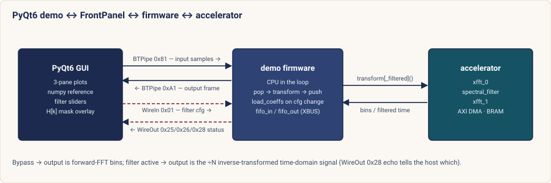

# `fft_demo` — desktop demo for the Ostomachion FFT accelerator

A PyQt6 + pyqtgraph application that drives the on-FPGA Xilinx **xfft**
pipeline in realtime, overlays the same input's `numpy.fft` spectrum, and
reports HW / SW timing alongside a numerical-agreement gauge.

It also **programs the fabric spectral filter** (low-/high-/band-pass, notch)
live: pick a filter, watch its mask `H[k]` shade the spectrum, and see the
**real FFT → filter → IFFT** output come back in the time domain — the genuine
fabric datapath, not a host-side numpy filter.

The CPU stays in the loop: the demo firmware reads each input frame from
the FrontPanel `BTPipeIn 0x81` FIFO into TX BRAM, calls `fft_accel_transform()`
(bypass → frequency bins) or, when a filter is selected, `fft_accel_transform_filtered()`
(→ filtered time-domain), and pushes the result back through `BTPipeOut 0xA1`.
The filter is chosen from the host over `WireIn 0x01`; the firmware echoes the
applied mode / availability / overflow on `WireOut 0x28`.  The host transport
replaces UART for bulk samples only — the existing accelerator driver, HAL, and
DMA contract from [`ACCEL_ARCH.md`](../../ACCEL_ARCH.md) are untouched.



When a filter is active the output frame is the **inverse-transformed**
(÷N-scaled) time-domain signal; in bypass it is the forward-FFT frequency bins,
exactly as before.  The firmware's `WireOut 0x28` echo tells the host which one
each frame is, so the GUI never mis-reads a frame.

## Prerequisites

The bitstream **must include** `fp_fft_pipe_bridge` in
`fpga/xem7310/xem7310_top.vhd` (merged on `master`).  Older bitstreams
built before that integration do not respond to `BTPipe 0x81 / 0xA1` or
`WireOuts 0x24..0x26`.

The **spectral-filter** controls additionally need the host-filter-control
bitstream: `WireIn 0x01`, `WireOut 0x28`, and the `spectral_filter` + `xfft_1`
datapath.  On a forward-FFT-only bitstream the demo still runs (source +
forward-FFT view), but the firmware reports `filter_avail = 0`, the filter
panel greys out, and `WireIn 0x01` writes are harmless no-ops — so it is safe
to launch against either bitstream.

1. **Build & program the bitstream** (one-time after clone, or when FPGA RTL changes):

   ```bash
   source scripts/init_dev_env.sh
   make fpga-synth      # ~20-40 min in Vivado
   make fpga-program    # over FrontPanel USB
   ```

2. **Build & upload the demo firmware**:

   The Zephyr app needs the `fp_uart_bridge` PTY available for the
   bootloader upload step.  Run, in three terminals:

   ```bash
   # Terminal 1 — keep the UART bridge running:
   make uart-bridge                   # prints PTY path (e.g. /dev/pts/3)

   # Terminal 2 — upload demo firmware over that PTY:
   make demo-hw UART_DEVICE=/dev/pts/3

   # Stop the bridge once upload completes (Ctrl-C in Terminal 1).
   # The bridge holds the FrontPanel device exclusively, so the demo
   # cannot open it while the bridge is running.
   ```

3. **Install the Python deps** (once per environment):

   ```bash
   source scripts/init_dev_env.sh    # activates ~/.zephyr-venv, exports FRONTPANEL_DIR
   pip install -r tools/fft_demo/requirements.txt
   ```

   `transport.py` adds `$FRONTPANEL_DIR/API/Python` to `sys.path`
   automatically, so `import ok` works as long as `FRONTPANEL_DIR` is
   set (which `scripts/init_dev_env.sh` does).

## Smoke test (recommended first run)

Headless CLI verification of the full bitstream + firmware + transport
chain.  Run from the repository root:

```bash
source scripts/init_dev_env.sh
PYTHONPATH=tools python -m fft_demo.smoke_test
```

The script pushes DC, single-bin cosines, and a sine + noise frame
through the bridge, checks the HW peak bins against `np.fft` expectations,
and prints HW cycles per frame.  Exit code is 0 on success.

Typical good run with a current `master` bitstream and `demo-hw` firmware:

```
Device : Opal Kelly XEM7310 sn=<redacted> fw=1.60
FIFOs  : in=0 out=0
  DC (amp=0.5)          peak bin=   0  expected=[0]          PASS
  Cosine bin 1          peak bin=   1  expected=[1, 4095]    PASS
  Cosine bin 64         peak bin=  64  expected=[64, 4032]   PASS
  Sine+noise bin 200    peak bin=3896  expected=[200, 3896]  PASS
Result : 4/4 cases passed
```

## Run

From the repository root:

```bash
source scripts/init_dev_env.sh
PYTHONPATH=tools python -m fft_demo
```

Then in the UI:

1. Click **Open FrontPanel**.  The status line shows the device serial.
2. Pick a source (Sine / Two sines / Noise / Sine + noise / DC) and
   tweak amplitude / bin (sliders) / noise σ.
3. *(Optional)* In **Spectral filter (fabric)** pick a mode (Low-pass /
   High-pass / Band-pass / Notch) and drag the cutoff (or band lo/hi)
   sliders.  Leave it on **Off** for the plain forward-FFT view.
4. Click **Start**.

Three stacked panes:

- **Input signal (time domain)** — the generated input, Re, fixed ±1 axis.
- **Filtered output (time domain)** — the IFFT result coming back from the
  fabric when a filter is active.  Because the inverse xfft is ÷N-scaled the
  round trip is ~1/N of the input, so this pane **autoranges** and labels the
  scale rather than faking a ×N gain.  On **Off** (or a forward-only bitstream)
  it shows a "filter off" note.
- **FFT magnitude (dB) + filter mask** — HW spectrum (orange) vs numpy
  reference (dashed green) in bypass; the chosen filter's passband `H[k]` is
  shaded in blue on top.  When a filter is active this pane shows
  `|FFT(input)|` (what went in) under the same mask.

The stats panel updates every frame:

| Field | Meaning |
|-------|---------|
| Frame #              | Firmware's free-running frame counter (WireOut 0x26). |
| HW FFT cycles        | `t1 - t0` around the transform in firmware (WireOut 0x25). |
| SW FFT (numpy)       | `time.perf_counter` around `np.fft.fft` on the host. |
| Host round-trip      | `send_frame` → frame_done → `recv_frame` wall-clock on the host. |
| End-to-end rate      | Frames per second, averaged over the last ~0.5 s. |
| Peak bin \|HW − SW\| | dB disagreement at the SW peak bin (bypass only; — when filtered). |
| HW SFDR              | Spurious-free dynamic range of the HW spectrum (bypass only). |
| Filter mode          | Mode the fabric is actually applying (from the WireOut 0x28 echo). |
| Out peak (FS frac)   | Filtered-output peak as a fraction of full scale (shows the ÷N attenuation honestly). |
| Overflow             | Red **OVERFLOW** if the last filtered transform saturated (WireOut 0x28 bit 4). |

## Spectral filter

The fabric implements a programmable per-bin complex filter between a forward
and an inverse xfft (see [`ACCEL_ARCH.md`](../../ACCEL_ARCH.md) §7).  The demo
drives it entirely from the host:

1. The **Spectral filter** panel packs `{mode, lo, hi}` into the `WireIn 0x01`
   control word (`filter_mask.pack_filter_cfg`).  Cutoffs are folded-frequency
   bins `0..N/2`; LP uses `hi` as the cutoff, HP uses `lo`, BP/notch use both
   (kept `lo ≤ hi`).  Slider drags are **debounced** (~120 ms) so a drag
   doesn't trigger a coefficient reload per pixel.
2. The firmware (`fft_demo_main.c`) reads + double-read-debounces that word,
   synthesises the brick-wall mask, loads it into the coeff BRAM, and switches
   to `fft_accel_transform_filtered()`.
3. The mask shaded in pane 3 is computed host-side by
   `filter_mask.synth_mask()`, which mirrors the firmware/`filter_mask.hpp`
   synthesis **bit-for-bit** — so the overlay shows exactly the passband the
   fabric applies.  `test_filter_mask.py` checks that correspondence at the
   boundary bins.

On a forward-FFT-only bitstream the firmware reports `filter_avail = 0` on the
echo; the panel greys out and the title says "NOT in this bitstream".

## What the numbers mean

- **HW FFT cycles** is the *compute-only* time inside
  `fft_accel_transform()` (DMA + xfft pipeline + IOC).  On healthy
  hardware it sits around 15 000 – 30 000 cycles (≈ 150 – 300 µs at
  100 MHz, see [`test_roundtrip_latency`](../../zephyr_app/tests/test_fft_accel.cpp)).
- **SW FFT (numpy)** runs on the host desktop CPU.  On a modern x86 with
  AVX numpy is typically *faster* than the FPGA for a single 4096-point
  transform — that's expected.  The interesting comparison would be
  against a NEORV32-side software FFT (kissfft), which is on the
  roadmap; the firmware reports HW cycles in isolation so we can add
  that later without changing the protocol.
- **Host round-trip** is dominated by USB latency and FrontPanel
  framing, not by the FFT itself.  Frame rate is normally limited by
  this, not by compute.
- **Peak bin \|HW − SW\|** evaluates the disagreement only at the bin
  where the SW spectrum is loudest (and at its conjugate alias for
  real-valued inputs).  For an integer-bin sinusoid this is the only
  bin that carries actual signal, so it cleanly separates "does the
  HW agree with numpy at the tone?" from "what does each path's
  noise floor look like?".  Expect ≲ 0.5 dB on healthy hardware.
- **HW SFDR** is the standard spurious-free-dynamic-range figure:
  peak HW bin minus the loudest HW bin that is *not* the peak.  For
  a single clean Q1.15 tone the FPGA pipeline sits in the 85 – 95 dB
  range; noisier inputs naturally bring it down.

## Operational notes

- The FrontPanel device is held exclusively.  The demo cannot run at
  the same time as `make uart-bridge` (or any other process holding the
  device).  Stop the bridge first.
- For a different board: `python -m fft_demo --serial <SERIAL>`.
- The transport blocks for at most 2 s waiting for the firmware to
  publish a new frame counter; if you see a timeout in the status line,
  the firmware probably isn't running (no `demo-hw` upload, wrong
  bitstream, or the `fft_accel` device failed to initialise).

## Files

| File | Purpose |
|------|---------|
| [`app.py`](app.py)          | PyQt6 main window, 3-pane plotting, filter panel, realtime loop. |
| [`transport.py`](transport.py)  | FrontPanel `ok.FrontPanel` wrapper (`send_frame`/`recv_frame`/`set_filter`/`applied_status`). |
| [`sources.py`](sources.py)      | Signal generators + Q1.15 / pipe pack-unpack. |
| [`filter_mask.py`](filter_mask.py) | Host brick-wall mask synthesis (matches firmware) + cfg/status word packing. |
| [`requirements.txt`](requirements.txt) | `PyQt6`, `pyqtgraph`, `numpy`. |

Tests (no Qt display / hardware needed unless noted):

| File | Run | Purpose |
|------|-----|---------|
| [`test_filter_mask.py`](test_filter_mask.py) | `python -m fft_demo.test_filter_mask` | Mask synth vs reference (boundary bins) + cfg/status round-trip. |
| [`test_ui_mock.py`](test_ui_mock.py) | `QT_QPA_PLATFORM=offscreen python -m fft_demo.test_ui_mock` | Widget/worker plumbing against a mock transport (freq↔time, overlay, autorange). |
| [`hil_filter_test.py`](hil_filter_test.py) | `python -m fft_demo.hil_filter_test` | **On hardware**: control-channel + brick-wall response on the real board. |

The matching firmware is
[`zephyr_app/src/fft_demo_main.c`](../../zephyr_app/src/fft_demo_main.c)
(built by `make demo-hw`), and the bridge RTL is
[`fpga/xem7310/fp_fft_pipe_bridge.vhd`](../../fpga/xem7310/fp_fft_pipe_bridge.vhd).
